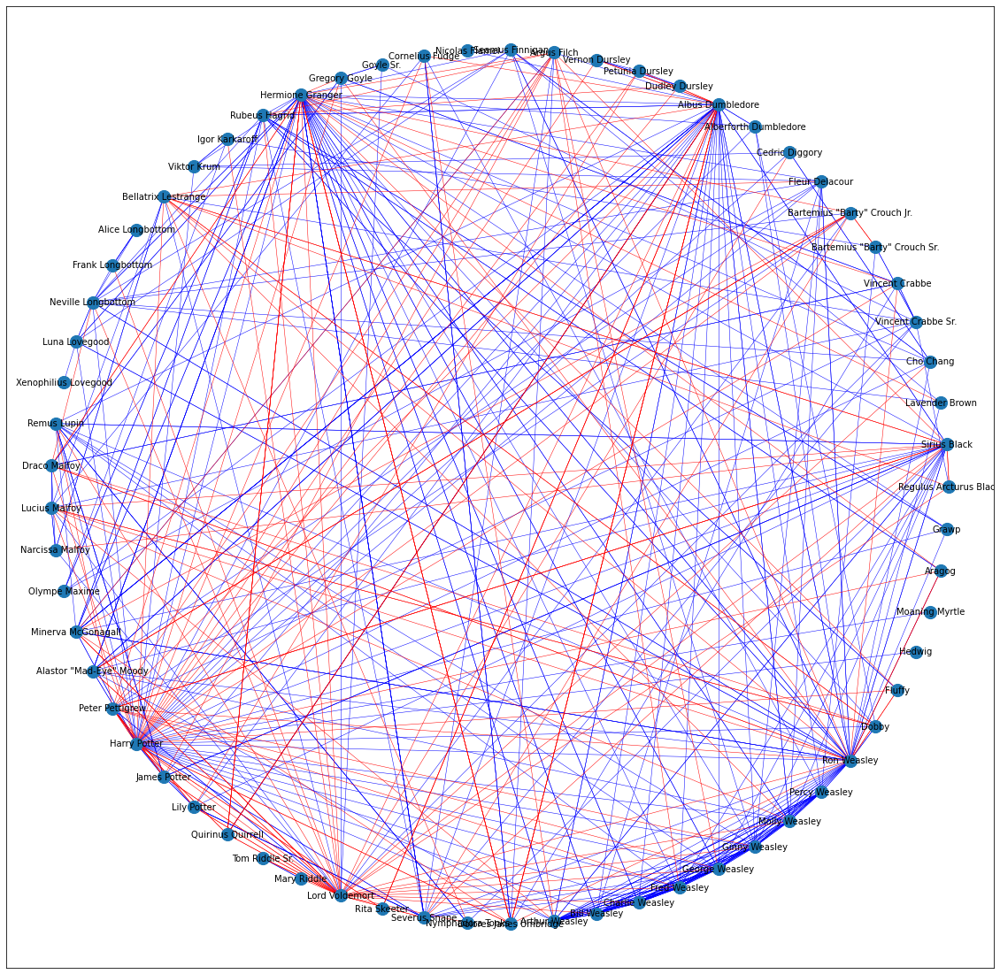

# Social network analysis of the characters of "Harry Potter"

> **_This project aims to delve into the relationships between the characters of the popular novel series, "Harry Potter", from a social network analysis perspective._**
>
> The dataset was obtained from https://github.com/efekarakus/potter-network
>
> The included code in python3 makes use of the 'networkx' module to create the network and the 'pyplot' module to draw the same.

